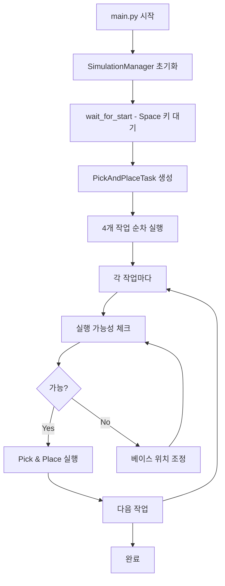

# 📚 MuJoCo Pick & Place 시뮬레이션 코드 설명서

## 📋 목차
1. [프로젝트 개요](#프로젝트-개요)
2. [전체 구조](#전체-구조)
3. [핵심 모듈 설명](#핵심-모듈-설명)
4. [실행 흐름](#실행-흐름)
5. [주요 변수 및 용어](#주요-변수-및-용어)
6. [키보드 조작](#키보드-조작)
7. [문제 해결 가이드](#문제-해결-가이드)

---

## 🎯 프로젝트 개요

이 프로젝트는 Stanford Tidybot 로봇이 4개의 방에서 Pick & Place 작업을 수행하는 MuJoCo 시뮬레이션입니다.

### 주요 특징
- **4개 방 환경**: 10m x 10m 공간을 4개 방으로 분할
- **8개 박스**: 각 방에 2개씩 (pick용 1개, place용 1개)
- **자동 작업**: Space 키만으로 전체 작업 자동 수행
- **실시간 제어**: 숫자패드로 로봇 이동

---

## 🏗️ 전체 구조

```
code2/
├── main.py                      # 진입점
├── simulation/
│   ├── simulation_manager.py    # 전체 시뮬레이션 관리
│   └── viewer_manager.py        # 뷰어 및 렌더링
├── controllers/
│   ├── arm/                    # 팔 제어
│   ├── base/                   # 베이스 이동
│   └── gripper/                # 그리퍼 제어
├── tasks/
│   └── pick_and_place.py       # Pick & Place 작업 로직
├── kinematics/
│   └── ik_solver.py            # 역기구학 계산
└── config/
    ├── constants.py            # 상수 정의
    └── robot_config.py         # 로봇 설정
```

---

## 📦 핵심 모듈 설명

### 1. **main.py** - 메인 실행 파일
```python
def main():
    # 1. SimulationManager 생성 (MuJoCo 모델 로드)
    sim_manager = SimulationManager(DEFAULT_XML_PATH)
    
    # 2. 사용자가 Space 키 누를 때까지 대기
    if wait_for_start(sim_manager):
        # 3. Pick & Place 작업 실행
        task = PickAndPlaceTask(sim_manager)
        task.execute()
```

**핵심 함수:**
- `wait_for_start()`: 시작 화면 표시 및 Space 키 대기
- `main()`: 프로그램 진입점

---

### 2. **simulation_manager.py** - 시뮬레이션 통합 관리

시뮬레이션의 모든 구성 요소를 초기화하고 관리합니다.

```python
class SimulationManager:
    def __init__(self, model_path):
        # MuJoCo 모델/데이터 로드
        self.model = mujoco.MjModel.from_xml_path(model_path)
        self.data = mujoco.MjData(self.model)
        
        # 주요 컴포넌트 초기화
        self.config = RobotConfig(self.model)         # 로봇 설정
        self.viewer_manager = ViewerManager(...)       # 뷰어
        self.ik_solver = InverseKinematicsSolver(...)  # IK 솔버
        
        # 공유 상태
        self.base_cmd_ref = np.copy(self.data.qpos[:3])  # 베이스 명령
        self.shared_gripper_ctrl = [0.0]                  # 그리퍼 제어
```

**주요 속성:**
- `model`, `data`: MuJoCo 물리 엔진 객체
- `base_cmd_ref`: 베이스 이동 명령 (x, y, theta)
- `shared_gripper_ctrl`: 그리퍼 제어값 (0=열림, 255=닫힘)
- `arm_home_q`: 팔 홈 자세 (7개 관절 각도)

**주요 메소드:**
- `start_mobility_control()`: 베이스 이동 스레드 시작
- `stop_mobility_control()`: 베이스 이동 정지
- `run_viewer()`: 뷰어 실행 루프

---

### 3. **pick_and_place.py** - Pick & Place 작업

4개 방의 작업을 순차적으로 관리합니다.

```python
class PickAndPlaceTask:
    def __init__(self, sim_manager):
        # 4개 작업 정의
        self.tasks = [
            {"pick": "red_box", "place": "blue_box", "room": "방 1"},
            {"pick": "green_box", "place": "yellow_box", "room": "방 2"},
            {"pick": "orange_box", "place": "purple_box", "room": "방 3"},
            {"pick": "cyan_box", "place": "pink_box", "room": "방 4"}
        ]
```

**실행 흐름:**
1. `execute()`: 전체 작업 실행
2. `_wait_for_space()`: Space 키 대기
3. `_execute_single_task()`: 단일 Pick & Place 실행
4. `_execute_waypoints()`: 웨이포인트 따라 이동

**웨이포인트 순서:**
```python
waypoints = [
    접근_시작,    # 박스 위 15cm
    파지_위치,    # 박스 위 2cm
    들어올리기,   # 박스 잡고 20cm 상승
    이동,        # 목표 박스 위로 이동
    놓기_위치,    # 목표 박스 위 15cm
    릴리즈,      # 박스 놓기
    복귀         # 시작 위치로
]
```

---

### 4. **arm_controller.py** - 팔 제어

7-DOF 로봇 팔을 제어합니다.

```python
class ArmController:
    def track_with_ruckig(self, q_target):
        # Ruckig을 사용한 부드러운 궤적 생성
        otg = Ruckig(7, 0.002)  # 7개 관절, 2ms 제어 주기
        
        # 궤적 파라미터 설정
        input_param.max_velocity = [3.0] * 7      # 최대 속도
        input_param.max_acceleration = [7.0] * 7  # 최대 가속도
        input_param.max_jerk = [150.0] * 7       # 최대 저크
```

**주요 기능:**
- `track_with_ruckig()`: 부드러운 궤적 추적
- `hold_position()`: 현재 위치 유지
- 토크 제어 기반 정밀 제어

---

### 5. **mobility_controller.py** - 베이스 이동

숫자패드 입력을 로봇 이동으로 변환합니다.

```python
class MobilityController:
    def control_loop(self):
        while self.active:
            # 키보드 입력을 명령으로 변환
            cmd = self.keyboard_handler.update_command(
                self.base_cmd_ref, 
                robot_heading  # 로봇 헤딩 기준 이동
            )
            # 베이스에 명령 적용
            self.base_teleop.apply_command(cmd)
```

**로봇 헤딩 기준 이동:**
- 로봇이 바라보는 방향이 "앞"
- 8키 = 전진, 5키 = 후진
- 4키 = 왼쪽, 6키 = 오른쪽

---

### 6. **ik_solver.py** - 역기구학

엔드이펙터 위치에서 관절 각도를 계산합니다.

```python
class InverseKinematicsSolver:
    def solve(self, target_pos, target_rpy):
        # SLSQP 최적화로 IK 해 계산
        result = minimize(
            self.objective_function,
            initial_q,
            method='SLSQP',
            bounds=self.bounds
        )
        return result.x  # 7개 관절 각도
```

**특징:**
- SLSQP(Sequential Least Squares Programming) 사용
- 관절 한계 고려
- 100ms 이내 수렴

---

### 7. **grasp_checker.py** - 파지 확인

그리퍼가 물체를 잡았는지 확인합니다.

```python
class GraspChecker:
    def wait_until_grasped(self, threshold=0.05, max_time=3.0):
        # 접촉력이 threshold 이상이면 파지 성공
        contact_force = self.get_gripper_contact_force()
        if contact_force > threshold:
            return True
```

---

## 🔄 실행 흐름



---

## 📖 주요 변수 및 용어

### MuJoCo 관련
| 변수 | 의미 | 설명 |
|------|------|------|
| `model` | MuJoCo 모델 | 로봇과 환경 정의 |
| `data` | 시뮬레이션 데이터 | 현재 상태 (위치, 속도 등) |
| `qpos` | Joint Position | 모든 관절 위치 |
| `ctrl` | Control Input | 액추에이터 제어 입력 |
| `xpos` | Cartesian Position | 바디의 3D 위치 |

### 로봇 관련
| 변수 | 의미 | 범위/단위 |
|------|------|-----------|
| `q` | 관절 각도 | 7개 값 (rad) |
| `ee` | End Effector | 말단 장치 |
| `base_cmd_ref` | 베이스 명령 | [x, y, theta] |
| `gripper_ctrl` | 그리퍼 제어 | 0(열림) ~ 255(닫힘) |

### 인덱스
```python
# qpos 인덱스
qpos[0:3]   # 베이스 위치 (x, y, theta)
qpos[3:10]  # 팔 관절 각도 (7개)
qpos[10]    # 그리퍼

# ctrl 인덱스  
ctrl[0:3]   # 베이스 제어
ctrl[3:10]  # 팔 제어
ctrl[10]    # 그리퍼 제어
```

---

## ⌨️ 키보드 조작

### 숫자패드 (베이스 이동)
```
[7] 좌회전    [8] 전진     [9] 우회전
[4] 좌이동    [5] 후진     [6] 우이동
              [2] 원점복귀
```

### 시스템 키
- **Space**: 시작 / 작업 진행
- **ESC**: 프로그램 종료

---

## 🔧 문제 해결 가이드

### 1. IK 솔루션 실패
```
"Pick & Place 수행 불가능: 목표가 도달 범위 밖"
```
**해결:** 제안된 베이스 위치로 이동

### 2. 파지 실패
```
"파지 실패: 접촉력 부족"
```
**해결:** 
- 박스가 그리퍼 중앙에 정렬되었는지 확인
- `GRIPPER_FORCE_THRESHOLD` 값 조정 (기본: 0.05N)

### 3. 벽 충돌
**해결:**
- 중앙 십자 통로 사용 (문 폭: 1.4m)
- 이동 속도 감소 (숫자패드 짧게 탭)

### 4. 느린 시뮬레이션
**해결:**
```xml
<!-- scene.xml에서 timestep 조정 -->
<option timestep="0.004"/>  <!-- 기본: 0.002 -->
```

---

## 📊 주요 파라미터

### 제어 파라미터 (constants.py)
```python
# 베이스 이동
BASE_LIN_STEP = 0.002    # 선속도 스텝 (m)
BASE_YAW_STEP = 0.002    # 각속도 스텝 (rad)

# 팔 제어
ARM_KP_HOLD = 400.0      # P 게인
ARM_KD_HOLD = 25.0       # D 게인

# Ruckig 궤적
RUCKIG_MAX_V = 3.0       # 최대 속도 (rad/s)
RUCKIG_MAX_A = 7.0       # 최대 가속도 (rad/s²)
RUCKIG_MAX_J = 150.0     # 최대 저크 (rad/s³)
```

### 작업 파라미터
```python
# 웨이포인트 높이
접근_높이 = 0.15  # 박스 위 15cm
파지_높이 = 0.02  # 박스 위 2cm
들기_높이 = 0.20  # 20cm 상승

# 실행 가능성
최소_거리 = 0.2  # 20cm
최대_거리 = 0.8  # 80cm
```

---

## 💡 팁과 트릭

### 1. 디버깅
```python
# 현재 상태 출력
print(f"베이스 위치: {self.data.qpos[:3]}")
print(f"팔 관절: {self.data.qpos[3:10]}")
print(f"그리퍼: {self.data.ctrl[10]}")
```

### 2. 실시간 모니터링
뷰어에서 `Ctrl+H`로 도움말 표시

### 3. 성능 최적화
- 불필요한 print 문 제거
- timestep 조정
- 뷰어 업데이트 빈도 감소

---

## 📚 참고 자료

- [MuJoCo Documentation](https://mujoco.readthedocs.io/)
- [Stanford Tidybot](https://tidybot.cs.princeton.edu/)
- [Ruckig Library](https://github.com/pantor/ruckig)

---

**작성일**: 2025-08-22  
**버전**: v2.2  
**작성자**: MuJoCo Pick & Place Team
